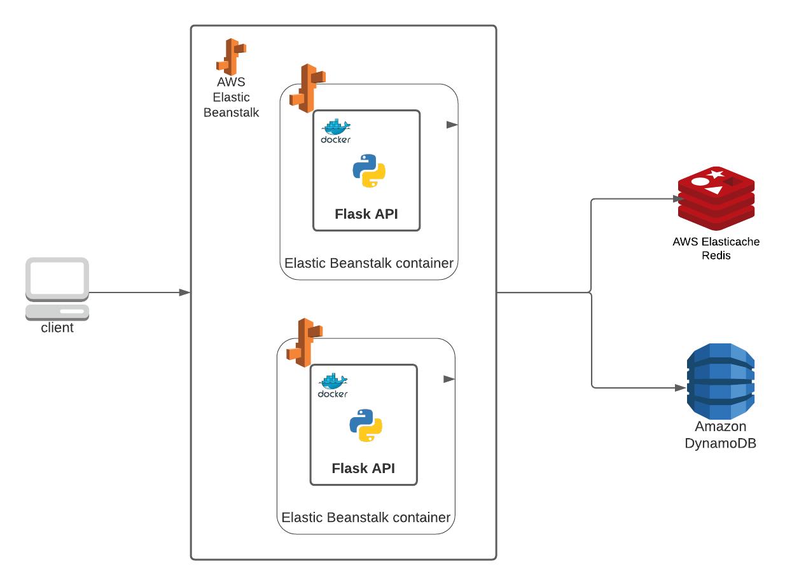

# GBM API CHALLENGE

## Tech Stack
Explaining the reasons behind the tech stack used to build this API:

* Python3, to develop and deploy powerful and light APIs,
* Docker, to containerize the Flask application and to add Data logging containers in the future. Plus containers are
more flexible to deploy at AWS (EBS, ECS, EKS, Fargate) and thus easier to scale horizontally,
* Redis, as cache database to catch repeated requests and avoid full round trips to DynamoDB, plus Elasticache allow for
managed replicated nodes that allows horizontal scalability
* DynamoDB, as the database to persist transactions and users and chosen because it is a managed NoSQL database that 
allows scalability,
* Elastic Beanstalk to let AWS scale the servers running the API.

Two servers at the beanstalk environment are always up so that the service is highly available. Redis is not
configured to self replicate for the sake of service costs.

### Further improvements
* Add API Gateway to manage the API interface at a more higher level: add throttling, quotas, burst, block by IP,
version management, etc.
* Centralized Logs (Datadog Agent) to monitor every single node running the API,
* Multicontainer deployment at Beanstalk to support containers as plugins to our application


## Design
General overview of the system design.



## API Documentation
[Documentation](https://app.swaggerhub.com/apis-docs/marioabz/Gbm.Code.Challenge0/gbm.api.challenge#/)

## Testing
To test this API in production you may use Postman as a way to test the paths and request for this API.
This repository has already a postman collection in place to just import the file and test the API.
Notice that the availability of the system is from 6:00 am to 3:00 pm CST (UTC-6).

## Deployment
```bash
docker pull mariobd7/gbm_code_challenge 
```

There are 2 docker compose files, one for the Elastic beanstalk (original docker-compose.yml) and one 
docker compose (2docker-compose.yml) to run Redis and the API locally.
To deploy and test locally first move '2docker-compose.yml' to 'docker-compose.yml' and run:
```
docker-compose up

```


---
Author: Mario Alberto Briseño Zamarripa
---